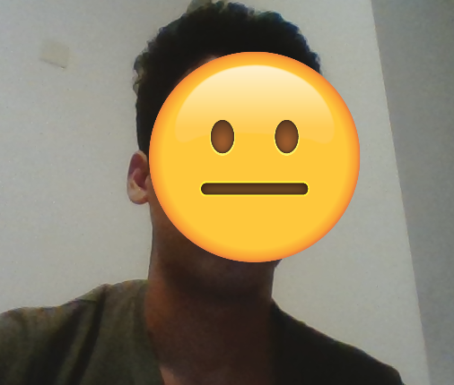
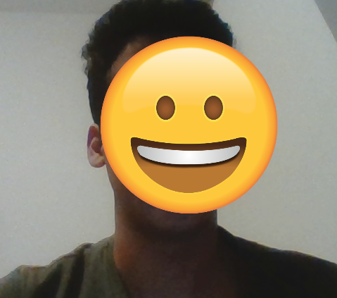
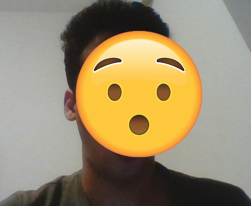
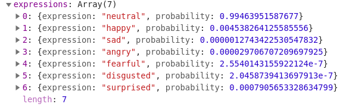

# Emojify
## What is this?
Have you ever felt tired of your face on camera? Do you  feel the need to express yourself but without showing your face?
Great! This is the perfect solution to your problems. 

Meet **Emojify**! It uses machine learning to read your facial expression and understand what you are feeling. And using the magic of drawing, it covers your face with an emoji instead. Voila!

## Examples
You can't see my face, but you can understand my expression :)

### neutral face

### happy face

### surprised face

## How it works
This project uses [face-api.js](https://github.com/justadudewhohacks/face-api.js?files=1) and [p5.js](http://p5js.org/). 
P5JS provides the video input and the html canvas on which the video is displayed.

All the code that makes it work is in [script.js](./js/script.js)

Face-api.js, which is built on top of [tensorflow.js](https://js.tensorflow.org/) has various pre-trained models that can be used for different purposes. This project uses a mobilenet model trained with faces from the internet (the SsdMobileNetv1 model). Along with face expression classification, the api also provides a bounding box for the face, using the coordinates of which an emoji is drawn on top of the face. The model has seven choices of emotions - 
  - Neutral
  - Happy
  - Sad
  - Angry
  - Surprise
  - Fear
  - Disgust

Given an input video image, it recognises the face(s), reads the expression(s) and returns an Array of probabilities of each emotion. 

My code loops over this array, finds the maximum probability emotion. I have an image file corresponding to each emotion that is preloaded. Using the x and y coordinates of the bounding box, my code as able to draw the image corresponding to the emotion almost exactly over the face of the person. 

## Why I did this
This project was an assignment for the class Interactive Machine Learning at NYU Shanghai. The task was to use machine learning in some creative way with a pre-trained model. I thought this was a really cool way to do something fun with machine learning. I hope that someday, instead of blurring people's faces out on media when consent is not given, someone could emojify their face instead. At least we'd be able to tell what the person is thinking, as opposed to nothing when there's a blurred face. 

## Potential Improvements
* It's kinda slow right now, but I guess that's because of how long it takes to classify the image. Could potentially only classify every nth frame instead of every frame. 
* Use the probabilities to map to different emojis that show the strength of the expression. Something like - 0.7 happy is a smiley face :) where as anything greater that 0.9 probability is a very happy face :D. This could be done for all the different emotions to make it more accurate. 
* Right now, the recognition of expressions is not really that accurate. Maybe retraining the model in some way could help fix this. 
